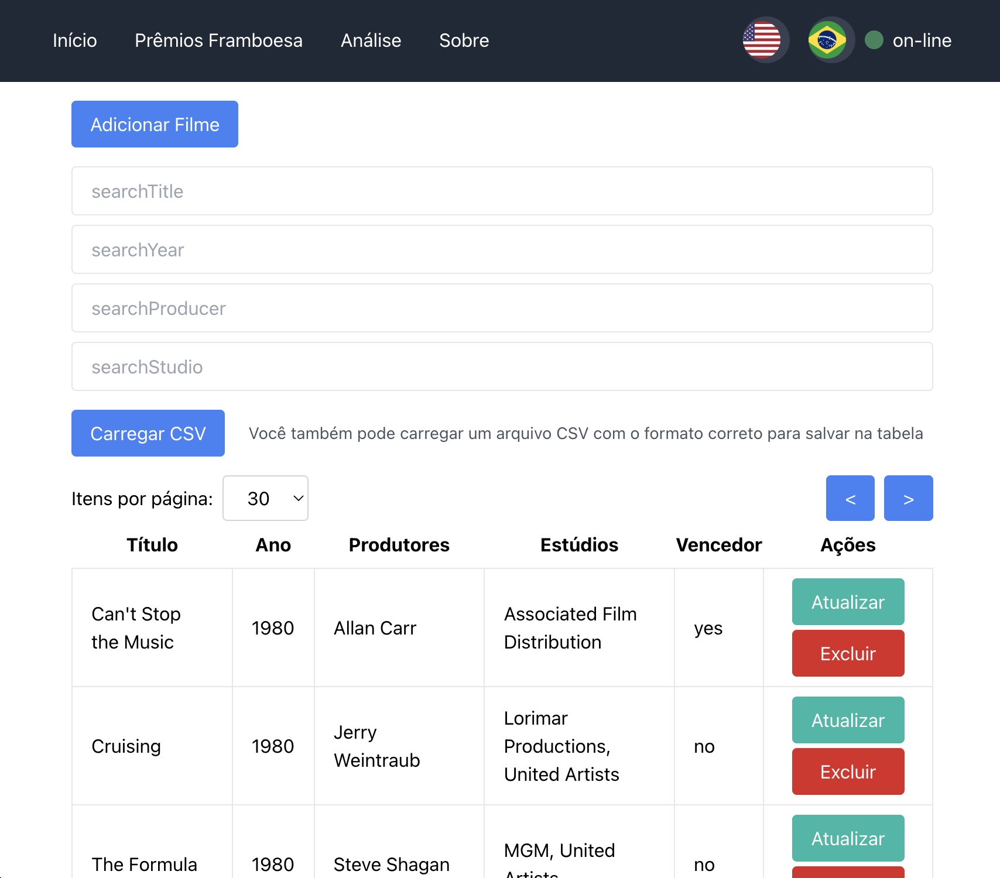
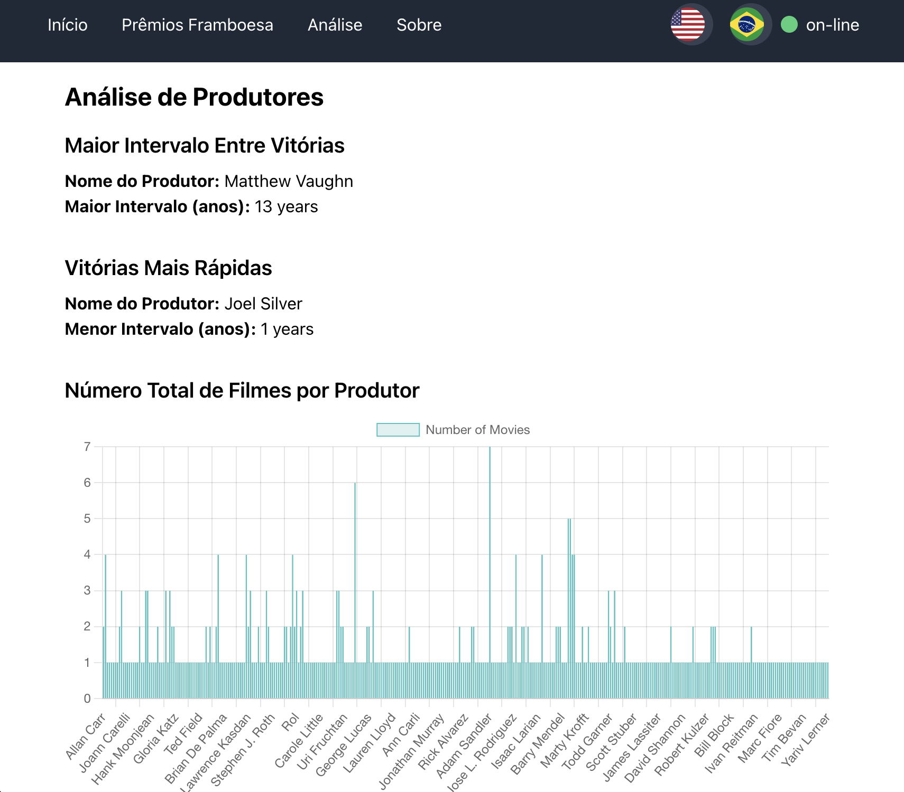

<a href="https://www.npmjs.com/~nestjscore" target="_blank"></a>

# Raspberry Awards Application

Develop a web application with a RESTful API to enable reading the list of nominees and winners of the Worst Picture category of the Golden Raspberry Awards, using React for the frontend, Node.js for the backend, and MongoDB as the database.

## Getting Started

### Running the Application

### 1. Clone the Repository

```bash
git clone https://github.com/Dikendev/raspberry-awards-client
cd raspberry-awards-client
```

### 2. Env file

Here is an example of a `.env` file to run the application

```plaintext
REACT_APP_API_BASE_URL=http://localhost:3000/api
```

### 3. Installation

To install all the dependencies, use the package manager [npm](https://www.npmjs.com/)

```bash
npm install
```

### 4. Build and Run the Application

Just use

```bash
npm start
```

### 5. Access the Application

You can access your React application at:

```bash
http://localhost:3100
```

## Demonstration Images

<div align="center">

### Página Principal



### Página de Analytics



<div align="start">
<br/>

## Conclusion

Project made for interview purpose

## Contributing

Pull requests are welcome <3. Please make sure to update tests as appropriate.

## License

[MIT](https://choosealicense.com/licenses/mit/)
